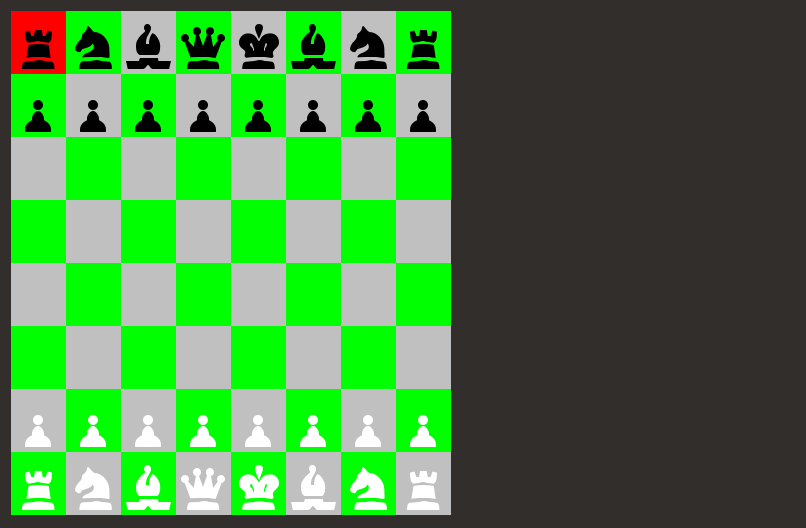

# LDTS_T13_G1307 - CHESS

## Game Description

This version of Chess is a representation of the classic strategy tabletop game Chess played between 2 players, in alternating turns. Each player has at their disposal 16 chess pieces (8 pawns, 2 rooks, 2 knights, 2 bishops, 1 queen and 1 king). Each type of piece has specific movement rules. When a player moves a piece to the same square as an enemy piece, the enemy piece is taken and the square is ocupied by the player piece. The king piece has to stay alive at all points, so when a check is initiated, the player needs to act in order to protect their king. Once the king has no safe squares from a check, it is a check-mate and the player loses.

This project was developed by Lucas Sousa (up202004682@edu.fe.up.pt), Vitor Cavaleiro (up202004724@edu.fe.up.pt) and Ricardo Matos (up202007962@edu.fe.up.pt) for LDTS 2021-22.

For a more detailed version of this description click [here](./docs/README.md).

## Screenshots

The following screenshots ilustrate the general look of our game, as well as the divergent functionalities:

 
 

###Game Preview

  

  <b><i>Gif.  </i></b>

  

 
 

 
 

### Menu

  

  <b><i>Fig 1. Main Menu </i></b>

  

 
 

### Game States

  

  <b><i>Fig 1. Starting Board </i></b>

  

 
 
