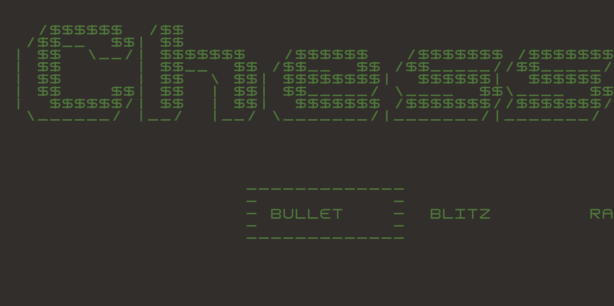
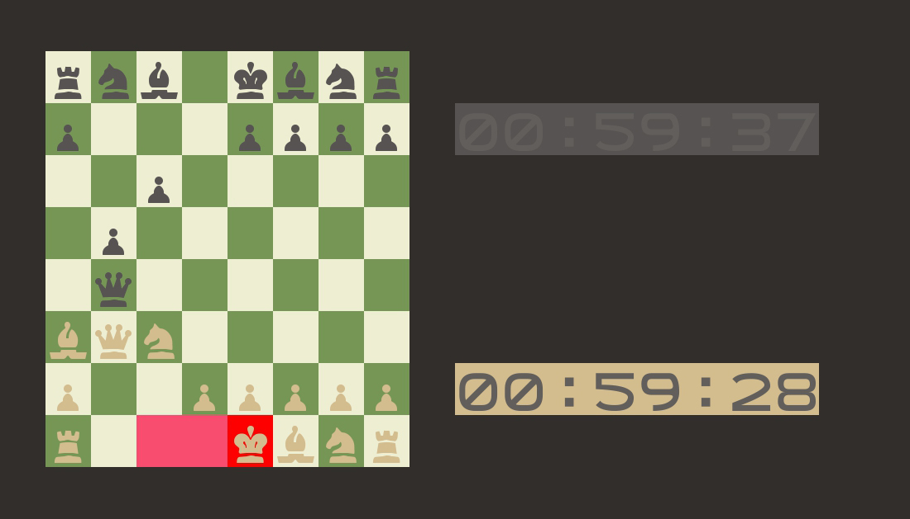
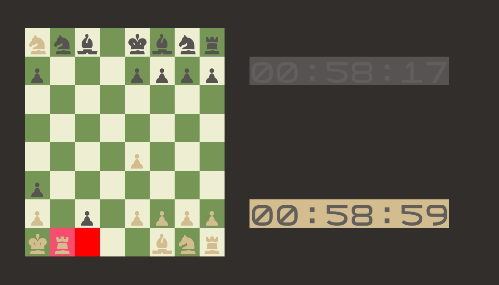
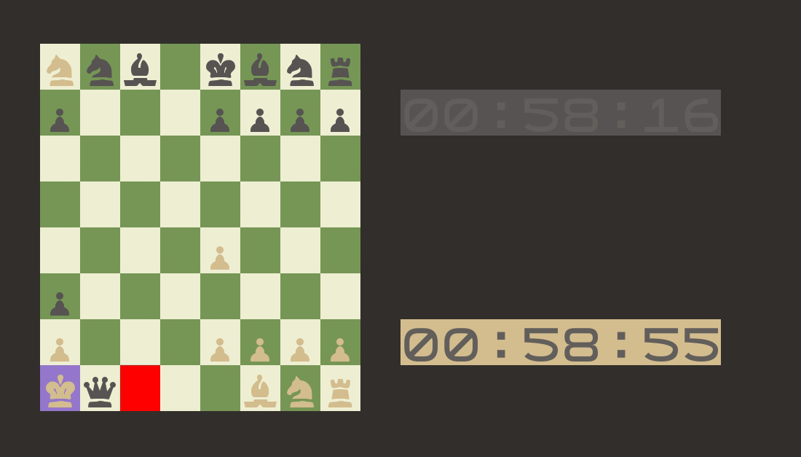

# LDTS_T13_G1307 - CHESS

- 
- TEST IN SPOCK: BetterCodeHub fails to recognize tests in spock.

- Error-Prone: we have left only 4 warnings that we think are not worth of changing (1 related to the game loop, the others to the use of
  printstacktrace())

- Pitest : we opt to omit some classes from the analysis which we thought were not susceptible of analysis

## Game Description

This version of Chess is a representation of the classic strategy tabletop game Chess played between 2 players, in alternating turns. Each player has at their disposal 16 chess pieces (8 pawns, 2 rooks, 2 knights, 2 bishops, 1 queen and 1 king). Each type of piece has specific movement rules. When a player moves a piece to the same square as an enemy piece, the enemy piece is taken and the square is occupied by the player piece. The king piece has to stay alive at all points, so when a check is initiated, the player needs to act in order to protect their king. Once the king has no safe squares from a check, it is a check-mate and the player loses.

In the game, you will start in a menu in which you will have to choose
the time control you want. The game provides all the standard rules and
move behaviours of a chess game, you can't commit suicide neither make any
move that's illegal, all moves and pieces are granted to be working as of a normal game.
To make a move, you select with your cursor the piece you want to move and then
the legal moves in red will indicate to which squares you can go. If you
don't have any legal move then it's either a draw or, in case you are in check
, a checkmate. If that's the case a pop-up screen will appear telling you the game has ended.
You can lose by time too, there are two types of clocks available, clocks
with increments and without them. In any time of the game you can press Backspace
and go back to the main menu. In a check the king will turn purple in order
to help you better understand what's going on. And last but not least,
the game has sound making it more exiting then ever before.

This project was developed by Lucas Sousa (up202004682@edu.fe.up.pt), Vitor Cavaleiro (up202004724@edu.fe.up.pt) and Ricardo Matos (up202007962@edu.fe.up.pt) for LDTS 2021-22.

For a more detailed version of this description click [here](./docs/README.md).

## Screenshots

The following screenshots illustrate the general look of our game, as well as the divergent functionalities:

### Game Preview

  

  <b><i>Gif. Game flow example </i></b>

  

 
 

 
 

### Menu 

  

  <b><i>Fig 1. Main Menu</i></b>

  

 
 

### Game States

  

  <b><i>Fig 1. Starting Board </i></b>

  

 
 

  

  <b><i>Fig 2. Castle 1/2</i></b>

  

 
 

  

  <b><i>Fig 3. Castle 2/2</i></b>

  

 
 

  

  <b><i>Fig 4. Pawn reaches other side and turns into queen 1/2</i></b>

  

 
 

  

  <b><i>Fig 5. Pawn reaches other side and turns into queen 2/2</i></b>

  

 
 

  

  <b><i>Fig 6. En passant 1/2</i></b>

  

 
 

  

  <b><i>Fig 7. En passant 2/2</i></b>

  

 
 

  

  <b><i>Fig 8. Check</i></b>

  

 
 

  

  <b><i>Fig 9. End screen by checkmate</i></b>

  

 
 

  

  <b><i>Fig 10. End screen by time</i></b>

  

 
 