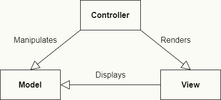
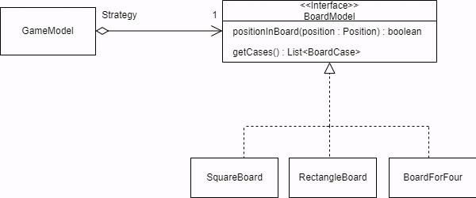

# LDTS_T13_G1307 - CHESS

## Game Description

This version of Chess is a representation of the classic strategy tabletop game Chess played between 2 players, in alternating turns. Each player has at their disposal 16 chess pieces (8 pawns, 2 rooks, 2 knights, 2 bishops, 1 queen and 1 king). Each type of piece has specific movement rules. When a player moves a piece to the same square as an enemy piece, the enemy piece is taken and the square is ocupied by the player piece. The king piece has to stay alive at all points, so when a check is initiated, the player needs to act in order to protect their king. Once the king has no safe squares from a check, it is a check-mate and the player loses.

This project was developed by Lucas Sousa (up202004682@edu.fe.up.pt), Vitor Cavaleiro (up202004724@edu.fe.up.pt) and Ricardo Matos (up202007962@edu.fe.up.pt) for LDTS 2021-22.

## Implemented Features

- **Menu** - When first running the game, the user will be met with a menu that can be navigated with the left and right arrows keys. It has the option to start a new game or to exit.
- **2 Player Game** - The game is will show a standard 8 by 8 square board, with 8 pawns, 2 rooks, 2 knights, 2 bishops, 1 queen and 1 king on either side, where 2 players take alternating turns moving their pieces.
- **Piece Movement** - The pieces of the game, when selected will be able to be moved to a correct, legal position based on the rules of the game (Ex: knight will only be able to move in an L shape, the bishop will only be able to move diagonaly).
- **Piece capturing** - When a Piece is moved to square occupied by an enemy piece, it will capture it. The enemy piece will be removed from the board and the other piece will take its square.
- **Cursor** - In each turn, the player will be able to select the desired piece, with the arrow keys, and then select a legal square for the piece to move into.

## Planned Features

- **Check** - When, in the current round, an enemy piece is threatening to capture the king a check is initiated. When this happens the player must act in order to protect the king and stop the check.

- **Checkmate** - During a check, when there is no possible way to protect the king and stop the check, there will be a Checkmate. The player who initiated the check will win and the game will return to the Main Menu.

- **Countdown Clock** - When starting a new game, the players will be asked the duration of the countdown clocks. During the game, each turn, the corresponding clock will start ticking down, stopping when the player has made their move. Subsequently, the other player's clock will do the same. When a player's clock reaches 0 the game will end and that player will lose.

## Design
### General Structure
Considering the nature of this project, in order to better design the GUI based game and to better implement the different game rules and conditions, we considered  its architeture an important consideration.

#### The Pattern:
As such, we decided to apply an Architectural Pattern, more specifically, the Model-View-Controller pattern.

#### Implementation:
- **Model** - Stores the data pertaining to the game, such as the positions of the pieces and their posible movements, aswell as the logic of the game and every piece.
- **View** - Handles the output of the graphical interface of the game through Lanterna, drawing the menu, board and its pieces.
- **Controller** - Handles all processes and changes of the Model and the View.

 
 

  

  <b><i>Fig 1. Model, Controller and Viewer pattern design </i></b>

  

 
 

#### Consequences:
- Organization of source code, allowing for better development
- High cohesion
- Better testability
- Better separation of the games logic
- Easier addition of features during development.

 
 

### Board Strategy
#### **Problem in context:**
Even though we only planned on the game having only one kind of board, the classic 8x8 board, we decided to develop it in a way that would allow for multiple kinds of boards.

#### The Pattern:
We applied the Strategy Pattern.

#### Implementation:
< needs to be written >

 
 

  

  <b><i>Fig 2. BoardModel Strategy (only SquareBoard is implemented) </i></b>

  

 
 

These classes can be found in the following files:
- [BoardModel](../src/main/java/model/game/board/BoardModel.java)
- [SquareBoard](../src/main/java/model/game/board/SquareBoard.java)

### Consequences:
Benefits of applying the above pattern:
 - Allows for different types of boards that differ only in their behaviour.
 - Is an alternative to subclassing.
 - Eliminates conditional statements.