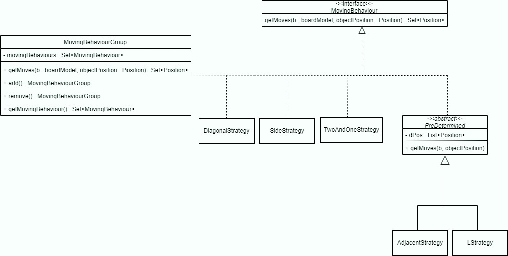
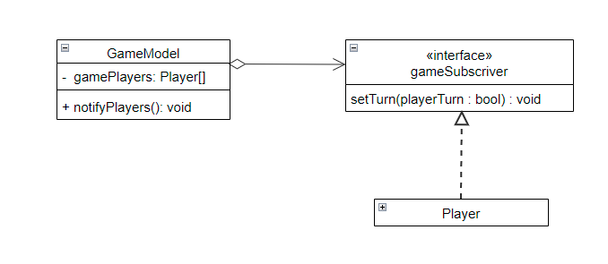
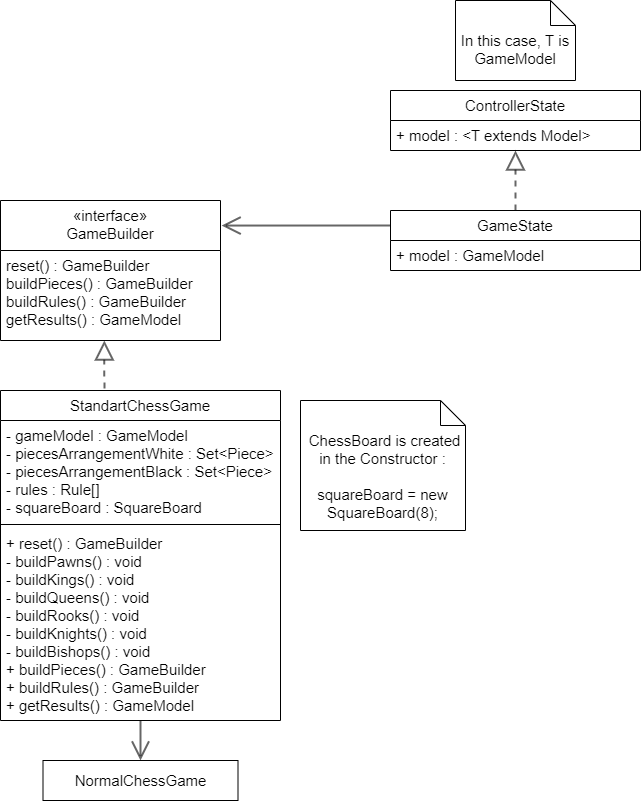
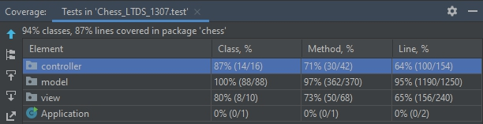

# LDTS_T13_G1307 - CHESS

## Game Description

This version of Chess is a representation of the classic strategy tabletop game Chess played between 2 players, in alternating turns. Each player has at their disposal 16 chess pieces (8 pawns, 2 rooks, 2 knights, 2 bishops, 1 queen and 1 king). Each type of piece has specific movement rules. When a player moves a piece to the same square as an enemy piece, the enemy piece is taken and the square is occupied by the player piece. The king piece has to stay alive at all points, so when a check is initiated, the player needs to act in order to protect their king. Once the king has no safe squares from a check, it is a check-mate and the player loses.

This project was developed by Lucas Sousa (up202004682@edu.fe.up.pt), Vitor Cavaleiro (up202004724@edu.fe.up.pt) and Ricardo Matos (up202007962@edu.fe.up.pt) for LDTS 2021-22.

## Implemented Features

- **Menu** - When first running the game, the user will be met with a menu that can be navigated with the left and right arrows keys. It has the option to start a new game or to exit.
- **2 Player Game** - The game is will show a standard 8 by 8 square board, with 8 pawns, 2 rooks, 2 knights, 2 bishops, 1 queen and 1 king on either side, where 2 players take alternating turns moving their pieces.
- **Piece Movement** - The pieces of the game, when selected will be able to be moved to a correct, legal position based on the rules of the game (Ex: knight will only be able to move in an L shape, the bishop will only be able to move diagonally).
- **Piece capturing** - When a Piece is moved to square occupied by an enemy piece, it will capture it. The enemy piece will be removed from the board and the other piece will take its square.
- **Cursor** - In each turn, the player will be able to select the desired piece, with the arrow keys, and then select a legal square for the piece to move into.

## Planned Features

Order by importance: 
- **Check** - When, in the current round, an enemy piece is threatening to capture the king a check is initiated. When this happens the player must act in order to protect the king and stop the check.

- **Checkmate** - During a check, when there is no possible way to protect the king and stop the check, there will be a Checkmate. The player who initiated the check will win and the game will return to the Main Menu.

- **Countdown Clock** - When starting a new game, the players will be asked the duration of the countdown clocks. During the game, each turn, the corresponding clock will start ticking down, stopping when the player has made their move. Subsequently, the other player's clock will do the same. When a player's clock reaches 0 the game will end and that player will lose.

- **New variants of chess** - This point will proof almost all the design patterns that we have created

- **New options to menu - depending on the above topic** - Creating options that allows you to choose the new variants

- **Maybe a Mouse Cursor and/or sound** - It would be cool to have a mouse courser

## Design
### General Structure
#### Problem in Context:
In order to make the code <b> more reusable </b>, <b> organizable  </b>, and so that it wouldn't break the <b>
Single Principle Responsibility </b> (which could easily happen) we decided to use the <b> MVC Architecture Pattern </b>.

#### The Pattern:
The MVC pattern separates the code in three packages the Model, View and Control. The model represents the logical
part of the program, the View is responsible for showing the program (depending on the model) and the controller is 
responsible for controlling the states of the program (depending on the previous two).

#### Implementation:
- **Model** - Stores the data pertaining to the game, such as the positions of the pieces and their possible movements, as well as the logic of the game and every piece.
- **View** - Handles the output of the graphical interface of the game through Lanterna, drawing the menu, board and its pieces.
- **Controller** - Controls the flow of the program.

 
 

  

  <b><i>Fig 1. Model, Controller and Viewer pattern design </i></b>

  

 
 

#### Consequences:
- Organization of source code, allowing for better development
- Modifications don't affect the entire program
- Better separation of the program logic from the view drawing
- Easier addition of features during development.
- Single Responsibility Principle is not violated
 
 

### Moving Pieces
#### **Problem in context:**
Moving a piece to a new square should be straight forward. You just grab a piece and put it in a new square.
However, there are moves that require a little more. Capturing, for instance, requires that the captured piece
is eliminated from the pieces in game, and then the piece that is capturing can go to take the new square.
Other example would be castling or promoting, in which, apart from the usual move of moving the piece to the new
square, we have to make others changes to (the rook should change col and the pawn should be promoted to another piece).
So we opt to use the <b> decorator pattern </b>, which will allow us to not violate the <b> Single Responsibility Principle </b>
, as we could have put all these behaviours in a class that implemented all of them, and let us create <b> new move behaviours </b>
that can be combined into new ones <b> making the code cleaner and reusable </b> (we mainly used the Simple Move as the wrappee
however we could have made funny things like, when you capture a piece you are able to promote it to another
, this happens because this pattern is good for <b> combining behaviours by wrapping the objets into multiple decorators </b> )

#### The Pattern:
We have applied the <b> decorator pattern </b>. Using it, we can extend a move behaviour combining it with multiple ones
that are wrapped inside it.

#### Implementation:
The interface Move defines the 3 methods that every Move must have, execute method is responsible for making
the move, while the others 2 are responsible for getting information about the moving piece and his new position.
The MoveDecorator is responsible for wrapping the Moves. Capturing, Castling and Promoting (the last two are
private classes in the rules responsible for handling/creating them) are moves that add an extra behaviour to the SimpleMove .
In that way, the SimpleMove (concrete component) defines the basic behaviour altered (by addition) from the concrete Decorators
(CapturingMove...).

 
 

  

  <b><i>Fig 2. Decorator pattern </i></b>

  

 
 

These classes can be found in the following files:
- [Move](../src/main/java/model/game/move/Move.java)
- [SimpleMove](../src/main/java/model/game/move/SimpleMove.java)
- [MoveDecorator](../src/main/java/model/game/move/MoveDecorator.java)
- [CapturingMove](../src/main/java/model/game/move/CapturingMove.java)
- [CastlingMove](../src/main/java/model/game/rules/Castle.java)
- [PromotingMove](../src/main/java/model/game/rules/PromotingPawns.java)

### Consequences:
Benefits of applying the above pattern:
 - Combination of several move behaviours by wrapping them into multiple decorators
 - Adding extra behaviours to an object at runtime
 - <b> Single Responsibility Principle obeyed </b>

### Board Strategy
#### Problem in context:
Even though we only planned on the game having only one kind of board, the classic 8x8 board, we decided to develop it in a way that would allow for multiple types of boards.
In this way we protected ourselves from going against the <b> Open-Closed Principle </b> and we let the game
open for new variants of the game.

#### The Pattern:
We have applied the Strategy Pattern. In this way we prevent future violations of the <b> SOLID </b>principles.
We also go in line with the good practises, by not "working" for the implementation but for the interface.

#### Implementation:

 
 

  

  <b><i>Fig 3. BoardModel Strategy (only SquareBoard is implemented) </i></b>

  

 
 

These classes can be found in the following files:
- [BoardModel](../src/main/java/model/game/board/BoardModel.java)
- [SquareBoard](../src/main/java/model/game/board/SquareBoard.java)

#### Consequences:
Benefits of applying the above pattern:
 - Allows for different types of boards that differ from the classical square board.
 - Isolate the implementation details. 
 - Obeys Open/Closed Principle. New strategies can be introduced without having to change the context.

 
 

### Possible moves for different pieces
#### Problem in context:
Each type of piece in the game can only move in very specific ways (Ex. Bishop can only move to diagonal squares), and some pieces move in similar ways to other pieces (Ex. Queen can move like a Bishop and like a Rook).

#### The pattern:
We have applied the <b>Composite Pattern</b>. This way we can create general behaviours for the more common moves, such as moving side-to-side or moving diagonally, and more specific behaviours for pieces like the Pawn.
We also have moving behaviour groups that combine different behaviours (Ex. The MovingBehaviourGroup associated with the queen is made up of a side moving behaviour and an adjacent moving behaviour).
Our implementation however, does not provide the option of recursively iterate through moving behaviours (we used a set here) as it wouldn't make sense 
to have a moving behaviour group with more than one equal moving behaviour (those squares would already be considered from the 
previous moving behaviour), so one could say that this is more of a <b> Strategy Pattern that calls combined strategy's </b>.
This pattern allows us to oby the <b> Open/Closed Principle </b> as it let us introduce new Moving behaviours without 
altering pre-existing code. 
#### Implementation:
 
 

  

  <b><i>Fig 4. Composite Pattern in MovingBehaviours </i></b>

  

 
 

These classes can be found in the following files:
- [MovingBehaviour](../src/main/java/model/game/pieces/movingBehaviours/MovingBehaviour.java)
- [MovingBehaviourGroup](../src/main/java/model/game/pieces/movingBehaviours/MovingBehaviourGroup.java)
- [PreDetermined](../src/main/java/model/game/pieces/movingBehaviours/PreDetermined.java)
- [AdjacentStrategy](../src/main/java/model/game/pieces/movingBehaviours/AdjacentStrategy.java)
- [LStrategy](../src/main/java/model/game/pieces/movingBehaviours/LStrategy.java)
- [DiagonalStrategy](../src/main/java/model/game/pieces/movingBehaviours/DiagonalStrategy.java)
- [SideStrategy](../src/main/java/model/game/pieces/movingBehaviours/SideStrategy.java)
- [TwoAndOneStrategy](../src/main/java/model/game/pieces/movingBehaviours/TwoAndOneStrategy.java)

#### Consequences:
Benefits of applying the above pattern:
 - Allows for simpler moving behaviours that can be composed into the more complex behaviours of the pieces.
 - Allows for the implementation of movingBehaviours that can be utilized by multiple pieces.
 - Isolate the implementation details.
 - Obeys Open/Closed Principle. New moving behaviours can be introduced without having to change the context.

 
 

### Player's turn
#### **Problem in context:**
After every move the players must be informed if it is their turn to play. If it is, then the player clock must start
ticking. So, the player must <b>observe the board</b> so that it can know <b> when the game turn state has been changed </b>.

#### The Pattern:
We have applied the <b> Observer Pattern </b>. With it, we can notify the player when it is his turn to play. And we can
easily add new subscribers to the game <b> without having to change the code in the GameModel </b>, which allows to follow
the <b> Open/Closed Principle </b>.

#### Implementation:
The notifyPlayers method in GameModel will inform the gamePlayers when a move is made and if it is his turn, the responsibility
to make the clock ticking/ stopping is from the Player. Every player implements an interface called GameSubscriber that tells the player
if it is his turn, informing the player that a move was made. <b> Note:</b> Clock is yet to be implemented.

 
 

  

  <b><i>Fig 5. Observer Pattern </i></b>

  

 
 

These classes can be found in the following files:
- [GameModel](../src/main/java/model/game/GameModel.java)
- [Player](../src/main/java/model/game/player/Player.java)
- [GameSubscriber](../src/main/java/model/game/GameSubscriber.java)

### Consequences:
Benefits of applying the above pattern:
- Follows Open/Close Principle.
- Establish relationships between objects allowing the players to know the state of the game.

 
 

### Building the chess game
#### Problem in context:
Before a game can start, there need's to be a defined set of rules, a board and a set of pieces each player can 
use. The program structure allows the programmer to build a customized game, however, we will focus on the traditional chess game, for now.
The fact that we construct a game based on pre-defined steps allows constructing games based on the client will, we could for instance 
create a game obj without rules ( which is known in chess as analysis). 

#### The pattern:
We have applied the <b> Builder Pattern </b> . With this pattern, we can organize the construction
of the game components in a much <b> cleaner and organized way </b>. It also allows the programmer <b> to easily add different gameplay components </b>.
In this way, we let the Game builder be the <b> constructor of the game </b> taking that responsibility from the GameModel,<b> avoiding
per se a code smell </b> and <b> respecting Single Responsibility Principle </b>
#### Implementation:
The standardChessGame class, the class that builds the classical chess game, has a build
method for every type of piece, take the buildBishops method for example, it will add to both set of pieces 2 bishops. The buildPieces method
combines all the methods that create the different pieces and the updateModelPieces method applies the pieces to the gameModel. The buildRules method assigns to the gameModel the set of rules the game obeys. The getResults method returns the complete gameModel 
, which will be received by the gameState.
 
 

  

  <b><i>Fig 6. Builder Pattern </i></b>

  

 
 

These classes can be found in the following files:
- [GameState](../src/main/java/controller/state/GameState.java)
- [GameBuilder](../src/main/java/model/game/builder/GameBuilder.java)
- [StandardChessGame](../src/main/java/model/game/builder/StandardChessGame.java)

#### Consequences:
Benefits of applying the above pattern:
 - Respects Single Responsibility Principle.
 - Allows construction code to be reused when building different types of chess games.
 - Allows the creation of objects step-by-step.

### Applying the rules of the game
#### Problem in context:
Every chess game and every variant of it has rules. We could have applied those rules in the pieces moving behaviour or even
in the pieces , however, this would come with a great price, <b> the violation of Single Responsibility Principle </b>. Why ?
Chess pieces would do must then they should and also know more than they should (<b> and this could become a future Open/Closed Principle violation</b>).
So we opt to use the <b> Filter Pattern </b> which solves the previous issues and gives flexibility to add/remove rules based
on the client wish without implying a SOLID violation. 
#### The pattern:

We opt to use the <b> Filter pattern </b>. This pattern is responsible for applying the rules based on the criteria defined by it.
Having the liberty to make changes to the moves that a piece can make without letting it know about those rules.

#### Implementation:
Every class that implements rule must receive a piece and a set of moves and apply the criteria defined by it.

 
 

  

  <b><i>Fig 6. Rule Pattern </i></b>

  

 
 

These classes can be found in the following package:
- [Rule](../src/main/java/model/game/rules)

#### Consequences:
Benefits of applying the above pattern:
- Allows more flexible code making it cleaner and easier
- Allows introduction of new rules without breaking <b> Open/Closed Principle </b>
- Keeps the <b> Responsibility of dealing with rules separated from the Pieces (Single Principle Responsibility) </b>

 
 

## Known Code Smells And Refactoring Suggestions
#### **Large Class**
We consider the [StandardChessGame](../src/main/java/model/game/builder/StandardChessGame.java) class a **Large Class** due to having a builder method for every piece. However, we find justifiable since every piece has an unique starting position in the layout of the game
and in this way the code gets cleaner and easier to understand ( we could have combined all the methods into one big one but that is not a good principle)
#### **Lazy Class**
We consider the child classes of the Piece class (Ex. Queen, Rook, etc) to be **Lazy Classes**. This is due to the fact 
that they don't do much outside of attributing the correct moving behaviour group and the character that corresponds with 
the symbol in the font that's shown on screen.

#### **Feature Envy**
The **Feature Envy** smell is present in the Rule class and in the classes that implement it. These classes decide which 
of possible moves for a piece are legal, filtering their possible moves. As such, they access the data of the pieces more
than their own. Due to our implementation of the pieces and behaviours, we find this code smell justifiable. Note that 
this smell comes <b> from the use of the filter pattern </b>.

#### **Speculative Generality**
The Clock and ClockModel classes, aswell as the getClock method in the Player class are **Speculative Generality** smells because they are related to the player countdown clocks that we intend to add in the future.

 
 

 ## Testing

### Screenshot of coverage report

  

  <b><i>Fig < need to add number >. Code coverage screenshot</i></b>

### Link to mutation testing reports
[Controller Mutation tests](../docs/mutation_test/202201082213/index.html)

[Model Mutation tests](../docs/mutation_test/202201082209/index.html)

[View Mutation tests](../docs/mutation_test/202201082223/index.html)
